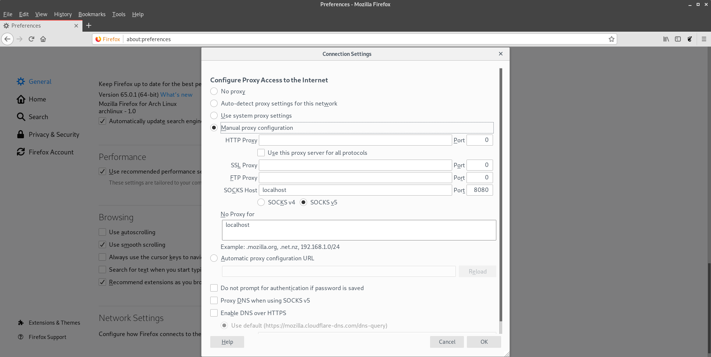

# OpenVPN Docker Image #
## Purpose ##
The purpose is to make a docker container that connects to an openvpn server without changing the host default routes. This makes it possible to have multiple openvpn clients running on the same host machine with minimal configuration.

This was also designed to be a permanent solution. The idea is that a docker image exists for each VPN connection wanted. So for each VPN connection, the build instructions must be followed.

## Instructions to Build ##

Build the project by:

```
docker build . --tag openvpn
```

Be sure the name does not contain a slash.

## Instructions to Use ##

### Running the VPN Client ###
To run the image, use the following command. Please note that the command **must** be ran in the same directory as the openvpn client files.

```
docker run --rm -d --cap-add=NET_ADMIN --sysctl net.ipv6.conf.all.disable_ipv6=0 --sysctl net.ipv6.conf.default.disable_ipv6=0 --sysctl net.ipv6.conf.lo.disable_ipv6=0  -p 127.0.0.1:<localhost port>:8085 -v "$(pwd)":/vpn openvpn
```
*If you want to add volumes to the host machine, add normal volume arguments to the command above.* 

The above command will run the container in the background. It will also forward a SOCKS5 proxy to the local machine on the specified port. This will allow applications to use the VPN tunnel if properly configured. See **Configuring Firefox with SOCKS Proxy** for more information.

To run openvpn, use the following command to open a new terminal:

```
docker exec -it <name of container> /bin/bash
```

This will open another terminal session. Navigate to the `/vpn` folder to find your files.

You can access data through the VPN. Please note that DNS may not be completely working due to limitations with the container. Thus, www.google.com may not work but 8.8.8.8 will. 


#### Finding ip address ####
Use the nslookup utility to find an ip address. This must be ran on a computer that can resolve the IP address normally. For instance, one your host machine that has a vpn connection open, type `nslookup <address>`. This will give you the corresponding ip address. Be sure not to select the DNS server ip address. 

When using the docker containers, then use the ip address found for the ssh connections.

### Stopping the VPN Client ###
To stop the VPN, type:

```
docker kill <name of VPN container>
```

### Configuring Firefox with SOCKS Proxy ###
Open `Firefox`. Go to `Preferences -> Network Settings`.

When the settings dialog box opens, click `Manual proxy configuration`. Enter the details like:



*Be sure to use the same port that you specified in the original command instead of 8080 as shown in the picture*